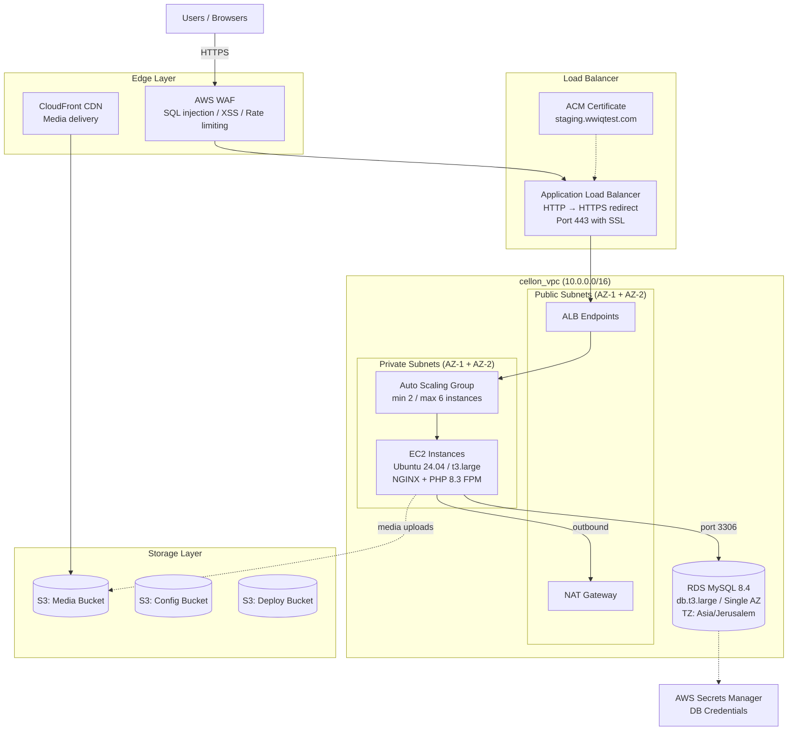
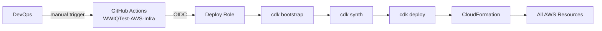
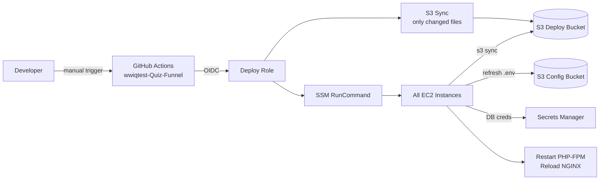

# WWIQTest Infrastructure Documentation

## 1. Overview

WWIQTest is a WordPress Multisite application deployed on AWS infrastructure in the Osaka region (ap-northeast-3). The infrastructure is managed as code using AWS CDK (TypeScript) and deployed through GitHub Actions with OIDC authentication — no long-lived credentials are stored anywhere.

The application runs on EC2 instances behind an Application Load Balancer with auto-scaling, backed by an RDS MySQL database, with media served through CloudFront CDN and protected by AWS WAF.

## 2. Architecture Diagram



## 3. AWS Account Details

| Item | Value |
|------|-------|
| AWS Account ID | 787955820621 |
| Region | ap-northeast-3 (Osaka, Japan) |
| VPC | vpc-0cc69755c328749d6 (cellon_vpc) |
| VPC CIDR | 10.0.0.0/16 |

## 4. Network Layer

The infrastructure is deployed into an existing VPC (`cellon_vpc`) that is shared with other production workloads. No network resources are created or modified by CDK.

### Subnets

| Subnet | ID | CIDR | AZ | Type |
|--------|----|------|----|------|
| Public A | subnet-05f10848a7c613c92 | 10.0.1.0/24 | ap-northeast-3a | Public |
| Public B | subnet-0897a4777f5bc835d | 10.0.2.0/24 | ap-northeast-3b | Public |
| Private A | subnet-0f3eee5d0ebdba502 | 10.0.3.0/24 | ap-northeast-3a | Private |
| Private B | subnet-0ec623a7ba52f1cf4 | 10.0.4.0/24 | ap-northeast-3b | Private |

### Networking Components

| Resource | ID | Details |
|----------|----|---------|
| Internet Gateway | igw-09848f6be0590a1a2 | Attached to VPC |
| NAT Gateway | nat-107d095275be6d711 | 2 Elastic IPs for outbound traffic |

## 5. Security

### 5.1 Security Groups

Traffic flows through a strict chain: Internet → ALB → App → DB. No direct access to application or database from the internet (except whitelisted DBA IPs for database).

| Security Group | Inbound Rules | Outbound Rules |
|----------------|---------------|----------------|
| wwiqtest-infra-sg-alb | Port 80, 443 from 0.0.0.0/0 | Port 80 to app SG only |
| wwiqtest-infra-sg-app | Port 80 from ALB SG only | All (for NAT/internet access) |
| wwiqtest-infra-sg-db | Port 3306 from app SG + DBA IPs | None |

### 5.2 DBA Access

The following static IPs are whitelisted for direct database access:

- 103.36.80.37/32
- 122.170.99.65/32
- 122.169.115.137/32
- 14.96.107.203/32
- 123.201.66.233/32

### 5.3 WAF (Web Application Firewall)

AWS WAF is attached to the ALB with the following rules:

| Rule | Priority | Description |
|------|----------|-------------|
| AWSManagedRulesCommonRuleSet | 1 | Blocks XSS, bad bots, path traversal |
| AWSManagedRulesSQLiRuleSet | 2 | Blocks SQL injection attempts |
| AWSManagedRulesKnownBadInputsRuleSet | 3 | Blocks known malicious patterns |
| Rate Limiting | 4 | Blocks IPs exceeding 2000 requests per 5 minutes |

### 5.4 IAM

| Role | Purpose | Permissions |
|------|---------|-------------|
| wwiqtest-infra-github-deploy-role | GitHub Actions deployment | AdministratorAccess |
| wwiqtest-infra-instance-role | EC2 instance profile | SSM, S3 read/write, Secrets Manager |

The deploy role uses OIDC federation — no access keys or secrets stored in GitHub. Only the following repositories on their respective branches can assume the role:

- `devcellon/WWIQTest-AWS-Infra` (main branch)
- `devcellon/wwiqtest-Quiz-Funnel` (master branch)

### 5.5 SSL/TLS

- ACM certificate for `staging.wwiqtest.com` and `*.staging.wwiqtest.com`
- HTTP (port 80) automatically redirects to HTTPS (port 443)
- SSL termination at the ALB level
- NGINX configured with `fastcgi_param HTTPS on` for WordPress compatibility

### 5.6 Secrets Management

- Database credentials are auto-generated by CDK and stored in AWS Secrets Manager (`wwiqtest-infra-db-credentials`)
- No password rotation configured
- Credentials are pulled dynamically by EC2 instances on boot and during deployments
- The `.env` file on instances has 600 permissions (owner read only)

## 6. Compute Layer

### 6.1 Application Load Balancer

| Property | Value |
|----------|-------|
| Name | wwiqtest-infra-alb |
| Type | Internet-facing |
| Subnets | Public A + Public B |
| HTTP Listener | Redirects to HTTPS (301) |
| HTTPS Listener | Port 443 with ACM certificate |
| Target Group | wwiqtest-infra-tg-app |
| Health Check | Path: `/`, Interval: 30s, Healthy: 2, Unhealthy: 3, Codes: 200,301,302 |

### 6.2 Auto Scaling Group

| Property | Value |
|----------|-------|
| Name | wwiqtest-infra-asg |
| Min Capacity | 2 |
| Max Capacity | 6 |
| Subnets | Private A + Private B |
| Health Check | ELB-based, 120s grace period |

### 6.3 EC2 Instances (Launch Template)

| Property | Value |
|----------|-------|
| Launch Template | wwiqtest-infra-lt |
| AMI | Custom (ami-0fbccfc446c31f87e) |
| Instance Type | t3.large (2 vCPU, 8 GB RAM) |
| Root Volume | 50 GB GP3, encrypted |
| OS | Ubuntu 24.04 LTS (Noble) |

### 6.4 Pre-installed Software (baked into AMI)

- NGINX 1.24.0 with WordPress multisite configuration
- PHP 8.3 FPM with extensions: mysql, curl, gd, mbstring, xml, zip, intl, imagick, bcmath
- AWS CLI v2
- GeoIP (libmaxminddb + GeoLite2-City database)
- jq, unzip

### 6.5 PHP Configuration

| Setting | Value |
|---------|-------|
| memory_limit | 3048M |
| upload_max_filesize | 64M |
| post_max_size | 64M |
| max_execution_time | 300s |

### 6.6 User Data (runs on every boot)

1. Syncs WordPress code from S3 deploy bucket (`--size-only`, skips `.env`)
2. Pulls `.env` from S3 config bucket
3. Fetches DB credentials from Secrets Manager and appends to `.env`
4. Sets file ownership and permissions
5. Starts PHP-FPM and NGINX

## 7. Database Layer

### 7.1 RDS MySQL

| Property | Value |
|----------|-------|
| Identifier | wwiqtest-infra-db |
| Engine | MySQL 8.4 |
| Instance Type | db.t3.large |
| Multi-AZ | No (single AZ) |
| Storage | 20 GB GP3, auto-scales to 500 GB |
| Timezone | Asia/Jerusalem |
| Database Name | wwiqtest |
| Master User | admin |
| Backup Retention | 7 days (point-in-time recovery enabled) |
| Deletion Protection | Enabled |
| Removal Policy | RETAIN (survives stack deletion) |
| Publicly Accessible | Yes (restricted by security group to DBA IPs + app SG) |

### 7.2 Connecting to the Database

**From EC2 instances:** Automatic via security group rules (port 3306).

**For DBAs:** Connect directly from whitelisted IPs, or use SSM port forwarding:

```bash
aws ssm start-session \
  --target <instance-id> \
  --document-name AWS-StartPortForwardingSessionToRemoteHost \
  --parameters '{"host":["<rds-endpoint>"],"portNumber":["3306"],"localPortNumber":["3306"]}'
```

## 8. Storage Layer

### 8.1 S3 Buckets

| Bucket | Purpose | Versioned | Public |
|--------|---------|-----------|--------|
| wwiqtest-infra-media-787955820621 | WordPress media uploads | No | No (CloudFront serves) |
| wwiqtest-infra-config-787955820621 | Environment configuration (.env) | Yes | No |
| wwiqtest-infra-deploy-787955820621 | Code deployment artifacts | Yes | No |

All buckets have block public access enabled and S3-managed encryption.

### 8.2 CloudFront CDN

| Property | Value |
|----------|-------|
| Origin | S3 media bucket (via Origin Access Control) |
| Protocol | HTTPS enforced |
| Cache Policy | Caching optimized for static assets |
| Allowed Methods | GET, HEAD |

CloudFront serves WordPress media files. The S3 bucket remains private — only CloudFront can access it via OAC.

## 9. Deployment

### 9.1 Infrastructure Deployment



- Repository: `devcellon/WWIQTest-AWS-Infra`
- Branch: `main`
- Trigger: Manual (workflow_dispatch)
- All configuration is in `cdk.json` — no hardcoded values in stack code

### 9.2 Code Deployment



- Repository: `devcellon/wwiqtest-Quiz-Funnel`
- Branch: `master`
- Trigger: Manual (workflow_dispatch)
- Uses `aws s3 sync --size-only` — only changed files are transferred
- No downtime during deployment

### 9.3 New Instance Boot (Auto Scaling)

When the ASG launches a new instance (scaling event or replacement):

1. Boots from custom AMI (~20 seconds) — all software pre-installed
2. User data runs S3 sync — pulls latest code changes (~10-30 seconds)
3. User data pulls `.env` + DB credentials
4. Instance starts serving traffic
5. ALB health check passes (~60 seconds)

Total time to serve traffic: ~90 seconds.

### 9.4 Environment Configuration

The `.env` file is stored in S3 (`wwiqtest-infra-config-787955820621`):

```
DOMAIN_CURRENT_SITE=staging.wwiqtest.com
IQ_BOOSTER_URL=https://iqbooster.project-demo.info
WP_DEBUG=false
```

DB credentials are appended automatically from Secrets Manager on every boot and deployment. Never put DB credentials in the S3 `.env` file.

To update environment variables:
1. Upload new `.env` to S3
2. Run the funnel deploy workflow

## 10. Configuration Reference

All infrastructure configuration is centralized in `cdk.json`:

| Section | Key | Current Value | Description |
|---------|-----|---------------|-------------|
| ec2 | instanceType | t3.large | EC2 instance size |
| ec2 | rootVolumeSize | 50 | Root volume in GB |
| ec2 | amiId | ami-0fbccfc446c31f87e | Custom AMI ID |
| asg | minCapacity | 2 | Minimum instances |
| asg | maxCapacity | 6 | Maximum instances |
| asg | healthCheckGracePeriod | 120 | Seconds before health check |
| rds | engineVersion | 8.4 | MySQL version |
| rds | instanceType | t3.large | DB instance size |
| rds | allocatedStorage | 20 | Initial storage in GB |
| rds | maxAllocatedStorage | 500 | Max auto-scale storage in GB |
| rds | backupRetentionDays | 7 | Backup retention period |
| rds | multiAz | false | Multi-AZ deployment |
| rds | publiclyAccessible | true | DBA direct access |
| rds | timeZone | Asia/Jerusalem | Database timezone |
| rds | deletionProtection | true | Prevent accidental deletion |
| waf | rateLimitPerIp | 2000 | Requests per 5 min per IP |

## 11. Naming Convention

- **Prefix:** `wwiqtest-infra`
- **Pattern:** `wwiqtest-infra-{resource}-{qualifier}`

### Tags Applied to All Resources

| Tag | Value |
|-----|-------|
| Project | wwiqtest |
| Component | infra |
| Environment | production |
| ManagedBy | cdk |

## 12. Cost Considerations

| Service | Configuration | Estimated Monthly Cost |
|---------|--------------|----------------------|
| EC2 (2x t3.large) | On-demand | ~$140 |
| RDS (db.t3.large, single AZ) | On-demand | ~$133 |
| ALB | Per hour + LCU | ~$25 |
| S3 (3 buckets) | Storage + requests | ~$5 |
| CloudFront | Requests + transfer | ~$5-20 |
| WAF | Web ACL + rules + requests | ~$10 |
| NAT Gateway | Per hour + data | Shared (existing) |
| Secrets Manager | 1 secret | ~$0.40 |
| **Total** | | **~$320-330/month** |

Costs can be reduced by using Reserved Instances for EC2 and RDS.

## 13. Disaster Recovery

| Scenario | Recovery Method | RTO |
|----------|----------------|-----|
| EC2 instance failure | ASG auto-replaces from AMI | ~90 seconds |
| Code rollback | Redeploy previous commit via GitHub | ~2 minutes |
| Database corruption | Point-in-time recovery (7 days) | ~15-30 minutes |
| Full stack recreation | CDK deploy (DB retained separately) | ~20 minutes |
| AMI update needed | Create new AMI, update cdk.json, deploy | ~15 minutes |
