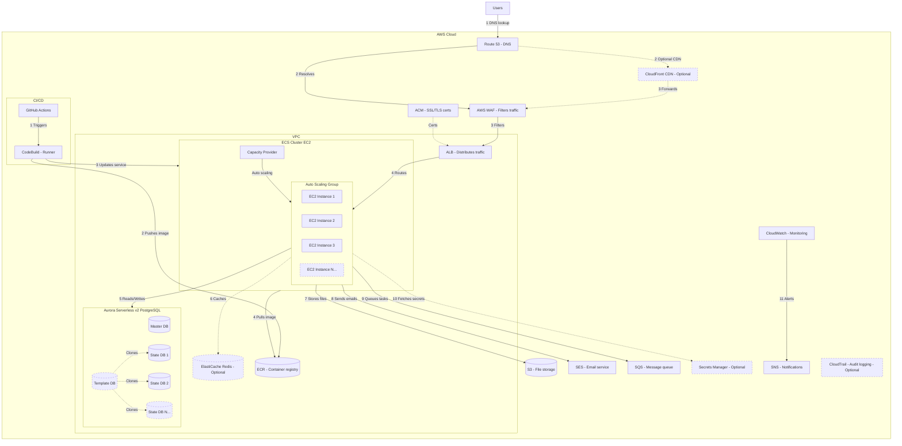

# Architecture Proposal: ECS-Based Multi-Tenant Application on AWS

## 1. Overview

This document proposes a containerized, multi-tenant application architecture running on Amazon ECS (EC2 launch type) within AWS. The design prioritizes cost efficiency, operational simplicity, horizontal scalability, and security.

---

## 2. Architecture Diagram

---

## 3. Request Flow (End to End)

### Step 1 — DNS Resolution
Users hit the application domain. Route 53 resolves the DNS and routes traffic into AWS.

### Step 2 — Edge Layer (Optional CDN)
If CloudFront is enabled, static assets are served from edge locations, reducing latency. CloudFront forwards dynamic requests downstream. If CloudFront is not used, Route 53 resolves directly to WAF.

### Step 3 — Security Filtering
AWS WAF inspects all incoming HTTP/HTTPS traffic. It filters out malicious requests (SQL injection, XSS, bot traffic, rate limiting) before they reach the application.

### Step 4 — Load Balancing
The Application Load Balancer (ALB) terminates SSL (via ACM certificates) and distributes traffic across healthy EC2 instances in the Auto Scaling Group. ALB supports path-based and host-based routing for multi-tenant scenarios.

### Step 5 — Application Processing (ECS on EC2)
Requests land on ECS tasks running on EC2 instances managed by an Auto Scaling Group. The ECS Capacity Provider handles scaling EC2 instances up/down based on task demand.

### Step 6 — Data Layer
- The application reads/writes to Aurora Serverless v2 (PostgreSQL). A Master DB handles core application data. A Template DB is cloned per tenant to create isolated State DBs (StateDB1, StateDB2, ... StateDBN), enabling multi-tenant data isolation.
- ElastiCache Redis (optional) provides caching for session data, frequently accessed queries, or rate limiting.

### Step 7 — File Storage
S3 handles all file/object storage — uploads, exports, static assets, backups.

### Step 8 — Email
SES sends transactional emails (notifications, password resets, reports).

### Step 9 — Async Processing
SQS queues background tasks (report generation, bulk operations, webhooks) for decoupled, reliable processing.

### Step 10 — Secrets
Secrets Manager (optional) stores and rotates database credentials, API keys, and other sensitive config. ECS tasks fetch secrets at runtime.

### Step 11 — Monitoring & Alerting
CloudWatch collects metrics, logs, and alarms. SNS delivers alerts (email, Slack, PagerDuty) when thresholds are breached. CloudTrail (optional) provides audit logging for compliance.

---

## 4. CI/CD Pipeline

| Step | Action |
|------|--------|
| 1 | Developer pushes code to GitHub, triggering GitHub Actions |
| 2 | GitHub Actions triggers AWS CodeBuild as the build runner |
| 3 | CodeBuild builds the Docker image and pushes it to ECR |
| 4 | CodeBuild updates the ECS service with the new task definition |
| 5 | ECS pulls the new image from ECR and performs a rolling deployment |

---

## 5. Why ECS on EC2?

### Why not a single/few EC2 instances (traditional deployment)?

| Concern | Single EC2 | ECS on EC2 |
|---------|-----------|------------|
| Scaling | Manual, vertical only (bigger instance) | Horizontal auto-scaling via Capacity Provider + ASG |
| Deployments | SSH-based, error-prone, downtime risk | Rolling deployments, zero-downtime, automated |
| Resource utilization | One app per instance, wasted capacity | Multiple containers per instance, bin-packing |
| Fault tolerance | Single point of failure | Tasks redistribute across healthy instances automatically |
| Environment consistency | "Works on my machine" drift | Docker containers guarantee identical environments |
| Rollback | Manual, risky | One-click rollback to previous task definition |
| Multi-tenancy | Hard to isolate workloads | Task-level isolation, per-tenant resource limits |

A single EC2 approach doesn't scale, doesn't self-heal, and makes deployments a manual, high-risk operation.

### Why not Kubernetes (EKS)?

| Concern | EKS (Kubernetes) | ECS on EC2 |
|---------|-------------------|------------|
| Operational complexity | High — control plane, networking (CNI), RBAC, Helm, service mesh | Low — AWS-managed orchestration, native IAM |
| Learning curve | Steep — kubectl, manifests, operators, CRDs | Minimal — task definitions, familiar AWS console/CLI |
| Cost | ~$73/month per cluster control plane + worker nodes + tooling overhead | No orchestration fee, pay only for EC2 instances |
| Team size needed | Typically needs dedicated platform/DevOps engineers | Small team can manage comfortably |
| Time to production | Weeks to months for production-grade setup | Days |
| Networking | Complex — VPC CNI plugin, pod networking, ingress controllers | Simple — ALB integration is native, awsvpc mode |
| Monitoring | Requires Prometheus/Grafana stack or third-party | Native CloudWatch integration out of the box |
| Vendor lock-in | Less (portable across clouds) | More (AWS-specific) |

Kubernetes is the right choice when you need multi-cloud portability, have a large platform team, or are running hundreds of microservices. For this workload — a focused application with a small-to-mid team — ECS gives us 90% of the orchestration benefits at 20% of the operational cost and complexity.

### Why ECS on EC2 and not ECS on Fargate?

Fargate is simpler (serverless containers), but EC2 launch type was chosen because:

- **Cost**: For sustained, predictable workloads, EC2 with Reserved Instances or Savings Plans is significantly cheaper than Fargate pricing.
- **Control**: EC2 gives access to instance-level tuning (instance types, storage, GPU if needed).
- **Capacity Provider**: The ASG + Capacity Provider combo gives us Fargate-like auto-scaling while keeping EC2 cost advantages.

---

## 6. Multi-Tenant Database Strategy

The Aurora cluster uses a template-cloning pattern:

- A **Template DB** holds the base schema and seed data.
- When a new tenant is onboarded, the template is cloned into a new **State DB** (StateDB1, StateDB2, etc.).
- This gives each tenant full data isolation while sharing the same Aurora Serverless v2 cluster for cost efficiency.
- Aurora Serverless v2 scales compute automatically, so tenant databases don't need individual capacity planning.

---

## 7. Optional Components

| Component | When to Enable |
|-----------|---------------|
| CloudFront | When serving static assets globally or needing DDoS protection at the edge |
| ElastiCache Redis | When caching is needed for performance (sessions, hot queries) |
| Secrets Manager | When you need automated secret rotation or compliance requires it |
| CloudTrail | When audit logging is required for compliance (SOC2, HIPAA, etc.) |

---

## 8. Security Posture

- All traffic is encrypted in transit (ACM + ALB SSL termination).
- WAF protects against OWASP Top 10 threats.
- Application runs inside a VPC with private subnets (EC2 instances are not publicly accessible).
- IAM roles scoped per ECS task (least privilege).
- Secrets Manager avoids hardcoded credentials.
- CloudTrail provides an audit trail of all API activity.

---

## 9. Cost Optimization Levers

- EC2 Reserved Instances or Savings Plans for baseline capacity.
- Auto Scaling Group scales out only when ECS needs more capacity.
- Aurora Serverless v2 scales to zero ACUs during idle periods.
- S3 lifecycle policies move old data to cheaper storage tiers.
- CloudFront reduces origin load and data transfer costs.

---

## 10. Patching & Maintenance Strategy

### OS & Instance Patching

- EC2 instances in the ASG use **Amazon ECS-optimized AMIs**, which are regularly updated by AWS with OS patches, Docker runtime updates, and ECS agent updates.
- Patching is handled via **rolling AMI replacement**: update the launch template with the latest AMI, then perform a rolling refresh of the ASG. ECS drains tasks from old instances and reschedules them on new ones — zero downtime.
- AWS Systems Manager (SSM) can be used for automated patch management and compliance scanning across all EC2 instances.

### Container Image Patching

- Application images are rebuilt in the CI/CD pipeline (CodeBuild) on every deployment, pulling the latest base image with security patches.
- ECR image scanning (enabled by default) flags known CVEs in container images on push.
- A scheduled pipeline can be set up to rebuild and redeploy images weekly even without code changes, ensuring base image patches are picked up.

### Database Patching

- Aurora Serverless v2 is **fully managed** — AWS handles all engine patching, minor version upgrades, and OS-level maintenance automatically.
- Major version upgrades are controlled by the team and can be scheduled during maintenance windows.

### Managed Services (Zero Patching Overhead)

The following services require no patching from our side — AWS manages them entirely:

| Service | Patching Responsibility |
|---------|------------------------|
| Route 53 | AWS managed |
| CloudFront | AWS managed |
| WAF | AWS managed |
| ALB | AWS managed |
| Aurora Serverless v2 | AWS managed (auto minor patches) |
| ElastiCache Redis | AWS managed (maintenance windows) |
| S3 | AWS managed |
| SES | AWS managed |
| SQS / SNS | AWS managed |
| Secrets Manager | AWS managed |
| CloudWatch / CloudTrail | AWS managed |
| ECR | AWS managed |

### Patching: ECS on EC2 vs Kubernetes (EKS) vs Single EC2

| Concern | Single EC2 | ECS on EC2 | EKS (Kubernetes) |
|---------|-----------|------------|-------------------|
| OS patching | Manual SSH, downtime risk | Rolling AMI refresh, zero downtime | Node group rolling update, but also need to patch control plane add-ons |
| Container runtime | Manual Docker updates | Included in ECS-optimized AMI | Must manage containerd/Docker separately |
| Orchestrator patching | N/A | AWS manages ECS control plane | Must upgrade EKS control plane + node groups + add-ons (CoreDNS, kube-proxy, VPC CNI) — typically 3-4 times/year |
| Security agent updates | Manual | SSM automated | Requires DaemonSets or node-level automation |
| Effort estimate | High, error-prone | Low, automated | Medium-high, multi-step process |

This is one of the key operational advantages of ECS over EKS — there is no control plane to patch, no add-ons to version-manage, and no CRD compatibility matrix to worry about.
