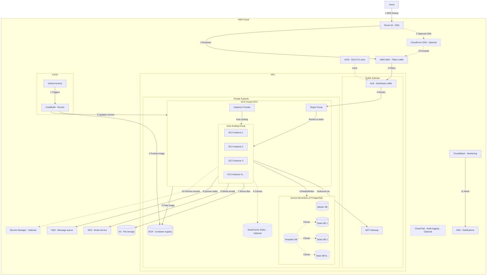

# Architecture Proposal: ECS-Based Multi-Tenant Application on AWS

## 1. Overview

This document proposes a containerized, multi-tenant application architecture running on Amazon ECS (EC2 launch type) within AWS. The design prioritizes cost efficiency, operational simplicity, horizontal scalability, and security.

---

## 2. Architecture Diagram

---

## Baseline Configuration

> Region: Asia Pacific (Mumbai) — `ap-south-1`. Prices are On-Demand as of March 2026. Actual costs may vary based on usage, data transfer, and applicable discounts (Reserved Instances, Savings Plans). Always verify against the [AWS Pricing Calculator](https://calculator.aws/) before finalizing budgets.

| Service | Starting Configuration | Unit Price (Mumbai, On-Demand) | Est. Monthly Cost |
|---------|----------------------|-------------------------------|-------------------|
| Route 53 | 1 hosted zone, wildcard DNS record | $0.50/month per hosted zone + $0.40 per million queries | ~$1 |
| CloudFront | Disabled initially (enable when needed) | $0.013/GB data transfer out (India) + $0.0095 per 10K requests | $0 (if enabled: ~$15–30 for 1 TB/month) |
| AWS WAF | 1 Web ACL + 3 managed rule groups (Core, SQLi, rate limiting) | $5.00/month per Web ACL + $1.00/month per rule group + $0.60 per million requests | ~$10 |
| ACM | 1 wildcard SSL certificate (`*.app.example.com`) | Free (public certs used with ALB/CloudFront) | $0 |
| ALB | 1 Application Load Balancer, 2 AZs | $0.0252/hour + $0.008 per LCU-hour | ~$20 |
| ECS Cluster | 1 cluster, EC2 launch type | No additional charge (ECS orchestration is free) | $0 |
| EC2 Instances (ASG) | 2x `t3.medium` (min), max 4, across 2 AZs | $0.0448/hour per instance | ~$65 (2 instances 24/7) |
| ECS Tasks | 2 tasks (1 per instance), 1 vCPU / 2 GB RAM per task | Included in EC2 cost | $0 |
| Aurora Serverless v2 | 1 cluster, min 0.5 ACU / max 8 ACU, PostgreSQL 15, Multi-AZ | $0.12/ACU-hour + $0.115/GB-month storage | ~$50–90 (0.5–1 ACU avg + 20 GB storage) |
| NAT Gateway | 1 NAT Gateway (single AZ) | $0.045/hour + $0.045 per GB processed | ~$35 + data charges |
| ElastiCache Redis | Disabled initially (enable when needed) | cache.t3.micro: ~$0.018/hour | $0 (if enabled: ~$13 for 1 node) |
| S3 | 1 bucket, versioning enabled, Standard storage class | $0.025/GB-month storage + $0.005 per 1K PUT requests | ~$3 (100 GB) |
| ECR | 1 private repository, image scanning enabled | $0.10/GB-month storage | ~$1 |
| SES | Sandbox mode initially, production access on go-live | $0.10 per 1,000 emails | ~$1 |
| SQS | 1 standard queue | $0.40 per million requests (first 1M free) | ~$0 |
| SNS | 1 topic (CloudWatch alerts) | $0.50 per million publishes + delivery charges | ~$0 |
| Secrets Manager | 1–2 secrets (DB credentials, API keys) | $0.40/secret/month + $0.05 per 10K API calls | ~$1 |
| CloudWatch | Basic monitoring, log groups per ECS service, 1–2 alarms | $0.10/alarm + $0.30/custom metric + $0.67/GB log ingestion | ~$5–10 |
| CloudTrail | Disabled initially (enable for compliance) | First trail free (mgmt events) + $2.00 per 100K data events | $0 (if enabled: ~$2–5 for mgmt events + S3 storage) |
| CodeBuild | 1 build project, `BUILD_GENERAL1_SMALL` | $0.005/build-minute (Linux) | ~$3 (100 min/month) |
| VPC | 1 VPC, 2 public subnets + 2 private subnets, 2 AZs | No charge for VPC/subnets | $0 |
| | | **Estimated Baseline Total** | **~$195–305/month** |

> **Notes:**
> - These are baseline starting values for a government project where user volumes are not yet confirmed. All auto-scaling components (ECS Capacity Provider, ASG, Aurora ACUs) will scale up automatically as demand increases.
> - The range depends primarily on Aurora ACU usage and NAT Gateway data processing.
> - EC2 costs can be reduced ~40–60% with 1-year Reserved Instances or Savings Plans.
> - SQS and SNS are effectively free at low volumes (1M free requests/month each).
> - Prices sourced from [AWS Pricing pages](https://aws.amazon.com/pricing/) and [aws-pricing.com](https://aws-pricing.com/ap-south-1.html) for ap-south-1. Verify before committing.

---

## 3. Request Flow (End to End)

### Step 1 — DNS Resolution
Users hit the application domain (e.g., `tenant1.app.example.com`). Route 53 resolves the wildcard DNS record (`*.app.example.com`) and routes traffic into AWS. The tenant identifier is embedded in the subdomain.

### Step 2 — Edge Layer (Optional CDN)
If CloudFront is enabled, static assets are served from edge locations, reducing latency. CloudFront forwards dynamic requests downstream. If CloudFront is not used, Route 53 resolves directly to WAF.

### Step 3 — Security Filtering
AWS WAF inspects all incoming HTTP/HTTPS traffic. It filters out malicious requests (SQL injection, XSS, bot traffic, rate limiting) before they reach the application.

### Step 4 — Load Balancing
The Application Load Balancer (ALB) terminates SSL (via ACM certificates) and distributes traffic to ECS tasks registered in a Target Group. The ALB does not route to EC2 instances directly — it routes to the ECS tasks (containers) running on those instances. ALB supports path-based and host-based routing for multi-tenant scenarios (see Section 6 for tenant routing details).

### Step 5 — Application Processing (ECS on EC2)
Requests land on ECS tasks running on EC2 instances in private subnets, managed by an Auto Scaling Group. The ECS Capacity Provider handles scaling EC2 instances up/down based on task demand. The application extracts the tenant identifier from the `Host` header and resolves the corresponding State DB connection from the tenant metadata table in the Master DB (see Section 6).

### Step 6 — Data Layer
- The application reads/writes to Aurora Serverless v2 (PostgreSQL), running in private subnets alongside the ECS tasks. A Master DB handles core application data and tenant routing metadata. Per-tenant State DBs (StateDB1, StateDB2, ... StateDBN) are cloned from a Template DB using PostgreSQL's `CREATE DATABASE ... TEMPLATE`, providing full data isolation per tenant (see Section 6 for details).
- ElastiCache Redis (optional, also in private subnets) provides caching for session data, frequently accessed queries, or rate limiting.

### Step 7 — File Storage
S3 handles all file/object storage — uploads, exports, static assets, backups. ECS tasks in private subnets access S3 via a VPC Gateway Endpoint (no NAT Gateway cost for S3 traffic) or through the NAT Gateway.

### Step 8 — Email
SES sends transactional emails (notifications, password resets, reports). Outbound traffic from ECS tasks to SES is routed through the NAT Gateway.

### Step 9 — Async Processing
SQS queues background tasks (report generation, bulk operations, webhooks) for decoupled, reliable processing. ECS tasks access SQS via VPC Interface Endpoints or through the NAT Gateway.

### Step 10 — Secrets
Secrets Manager (optional) stores and rotates database credentials, API keys, and other sensitive config. ECS tasks fetch secrets at runtime via the AWS API (routed through VPC endpoints or NAT Gateway).

### Step 11 — Monitoring & Alerting
CloudWatch collects metrics, logs, and alarms. SNS delivers alerts (email, Slack, PagerDuty) when thresholds are breached. CloudTrail (optional) provides audit logging for compliance.

---

## 4. CI/CD Pipeline

| Step | Action |
|------|--------|
| 1 | Developer pushes code to GitHub, triggering GitHub Actions |
| 2 | GitHub Actions triggers AWS CodeBuild as the build runner |
| 3 | CodeBuild builds the Docker image and pushes it to ECR |
| 4 | CodeBuild updates the ECS service with the new task definition |
| 5 | ECS pulls the new image from ECR and performs a rolling deployment |

### Environment Promotion

The pipeline supports three environments: **dev**, **staging**, and **production**.

- Pushes to `develop` automatically deploy to the **dev** environment.
- Merges to `main` deploy to **staging** automatically, with a manual approval gate before promoting to **production**.
- Each environment runs in its own ECS service (and optionally its own cluster) with separate Aurora databases and configuration.
- Environment-specific variables (DB endpoints, feature flags, secrets) are managed via SSM Parameter Store or Secrets Manager, scoped per environment.

---

## 5. Why ECS on EC2?

### Why not a single/few EC2 instances (traditional deployment)?

| Concern | Single EC2 | ECS on EC2 |
|---------|-----------|------------|
| Scaling | Manual, vertical only (bigger instance) | Horizontal auto-scaling via Capacity Provider + ASG |
| Deployments | SSH-based, error-prone, downtime risk | Rolling deployments, zero-downtime, automated |
| Resource utilization | One app per instance, wasted capacity | Multiple containers per instance, bin-packing |
| Fault tolerance | Single point of failure | Tasks redistribute across healthy instances automatically |
| Environment consistency | "Works on my machine" drift | Docker containers guarantee identical environments |
| Rollback | Manual, risky | One-click rollback to previous task definition |
| Multi-tenancy | Hard to isolate workloads | Task-level isolation, per-tenant resource limits |

A single EC2 approach doesn't scale, doesn't self-heal, and makes deployments a manual, high-risk operation.

### Why not Kubernetes (EKS)?

| Concern | EKS (Kubernetes) | ECS on EC2 |
|---------|-------------------|------------|
| Operational complexity | High — control plane, networking (CNI), RBAC, Helm, service mesh | Low — AWS-managed orchestration, native IAM |
| Learning curve | Steep — kubectl, manifests, operators, CRDs | Minimal — task definitions, familiar AWS console/CLI |
| Cost | ~$73/month per cluster control plane + worker nodes + tooling overhead | No orchestration fee, pay only for EC2 instances |
| Team size needed | Typically needs dedicated platform/DevOps engineers | Small team can manage comfortably |
| Time to production | Weeks to months for production-grade setup | Days |
| Networking | Complex — VPC CNI plugin, pod networking, ingress controllers | Simple — ALB integration is native, awsvpc mode |
| Monitoring | Requires Prometheus/Grafana stack or third-party | Native CloudWatch integration out of the box |
| Vendor lock-in | Less (portable across clouds) | More (AWS-specific) |

Kubernetes is the right choice when you need multi-cloud portability, have a large platform team, or are running hundreds of microservices. For this workload — a focused application with a small-to-mid team — ECS gives us 90% of the orchestration benefits at 20% of the operational cost and complexity.

### Why ECS on EC2 and not ECS on Fargate?

Fargate is simpler (serverless containers), but EC2 launch type was chosen because:

- **Cost**: For sustained, predictable workloads, EC2 with Reserved Instances or Savings Plans is significantly cheaper than Fargate pricing.
- **Control**: EC2 gives access to instance-level tuning (instance types, storage, GPU if needed).
- **Capacity Provider**: The ASG + Capacity Provider combo gives us Fargate-like auto-scaling while keeping EC2 cost advantages.

---

## 6. Multi-Tenant Strategy

### Tenant Routing

Tenant identification is handled at the application layer using subdomain-based routing:

- Each tenant is assigned a subdomain (e.g., `tenant1.app.example.com`, `tenant2.app.example.com`).
- Route 53 uses a wildcard DNS record (`*.app.example.com`) pointing to the ALB.
- The ALB forwards all requests to the ECS tasks. The application extracts the tenant identifier from the `Host` header and routes the request to the correct State DB.
- This approach avoids ALB listener rule sprawl and keeps tenant onboarding simple — no infrastructure changes needed per tenant.

### Database Strategy

The Aurora cluster uses a template-cloning pattern:

- A **Template DB** holds the base schema and seed data.
- When a new tenant is onboarded, the template is cloned into a new **State DB** (StateDB1, StateDB2, etc.) using `CREATE DATABASE ... TEMPLATE` (PostgreSQL template databases). This is a server-level copy operation that duplicates the schema and seed data in seconds for small-to-medium templates. For larger templates, `pg_dump`/`pg_restore` can be used as an alternative.
- This gives each tenant full data isolation while sharing the same Aurora Serverless v2 cluster for cost efficiency.
- Aurora Serverless v2 scales compute automatically, so tenant databases don't need individual capacity planning.
- A tenant metadata table in the Master DB maps tenant identifiers (subdomains) to their corresponding State DB connection details.

---

## 7. Optional Components

| Component | When to Enable |
|-----------|---------------|
| CloudFront | When serving static assets globally or needing DDoS protection at the edge |
| ElastiCache Redis | When caching is needed for performance (sessions, hot queries) |
| Secrets Manager | When you need automated secret rotation or compliance requires it |
| CloudTrail | When audit logging is required for compliance (SOC2, HIPAA, etc.) |

---

## 8. Security Posture

- All traffic is encrypted in transit (ACM + ALB SSL termination).
- WAF protects against OWASP Top 10 threats.
- The VPC is segmented into public and private subnets. The ALB and NAT Gateway sit in public subnets. All EC2 instances, ECS tasks, Aurora databases, and ElastiCache reside in private subnets with no direct internet access.
- Outbound internet access from private subnets (for pulling images, sending emails, etc.) is routed through a NAT Gateway.
- IAM roles scoped per ECS task (least privilege).
- Secrets Manager avoids hardcoded credentials.
- CloudTrail provides an audit trail of all API activity.

---

## 9. Cost Optimization Levers

- EC2 Reserved Instances or Savings Plans for baseline capacity.
- Auto Scaling Group scales out only when ECS needs more capacity.
- Aurora Serverless v2 scales down to a minimum of 0.5 ACUs during idle periods, keeping costs low without full cluster pauses.
- S3 lifecycle policies move old data to cheaper storage tiers.
- CloudFront reduces origin load and data transfer costs.

---

## 10. Patching & Maintenance Strategy

### OS & Instance Patching

- EC2 instances in the ASG use **Amazon ECS-optimized AMIs**, which are regularly updated by AWS with OS patches, Docker runtime updates, and ECS agent updates.
- Patching is handled via **rolling AMI replacement**: update the launch template with the latest AMI, then perform a rolling refresh of the ASG. ECS drains tasks from old instances and reschedules them on new ones — zero downtime.
- AWS Systems Manager (SSM) can be used for automated patch management and compliance scanning across all EC2 instances.

### Container Image Patching

- Application images are rebuilt in the CI/CD pipeline (CodeBuild) on every deployment, pulling the latest base image with security patches.
- ECR image scanning (enabled by default) flags known CVEs in container images on push.
- A scheduled pipeline can be set up to rebuild and redeploy images weekly even without code changes, ensuring base image patches are picked up.

### Database Patching

- Aurora Serverless v2 is **fully managed** — AWS handles all engine patching, minor version upgrades, and OS-level maintenance automatically.
- Major version upgrades are controlled by the team and can be scheduled during maintenance windows.

### Managed Services (Zero Patching Overhead)

The following services require no patching from our side — AWS manages them entirely:

| Service | Patching Responsibility |
|---------|------------------------|
| Route 53 | AWS managed |
| CloudFront | AWS managed |
| WAF | AWS managed |
| ALB | AWS managed |
| Aurora Serverless v2 | AWS managed (auto minor patches) |
| ElastiCache Redis | AWS managed (maintenance windows) |
| S3 | AWS managed |
| SES | AWS managed |
| SQS / SNS | AWS managed |
| Secrets Manager | AWS managed |
| CloudWatch / CloudTrail | AWS managed |
| ECR | AWS managed |

### Patching: ECS on EC2 vs Kubernetes (EKS) vs Single EC2

| Concern | Single EC2 | ECS on EC2 | EKS (Kubernetes) |
|---------|-----------|------------|-------------------|
| OS patching | Manual SSH, downtime risk | Rolling AMI refresh, zero downtime | Node group rolling update, but also need to patch control plane add-ons |
| Container runtime | Manual Docker updates | Included in ECS-optimized AMI | Must manage containerd/Docker separately |
| Orchestrator patching | N/A | AWS manages ECS control plane | Must upgrade EKS control plane + node groups + add-ons (CoreDNS, kube-proxy, VPC CNI) — typically 3-4 times/year |
| Security agent updates | Manual | SSM automated | Requires DaemonSets or node-level automation |
| Effort estimate | High, error-prone | Low, automated | Medium-high, multi-step process |

This is one of the key operational advantages of ECS over EKS — there is no control plane to patch, no add-ons to version-manage, and no CRD compatibility matrix to worry about.

---

## 11. Disaster Recovery & Backup Strategy

### Recovery Objectives

| Metric | Target |
|--------|--------|
| RPO (Recovery Point Objective) | 5 minutes (Aurora continuous backups) |
| RTO (Recovery Time Objective) | < 30 minutes (automated failover + ECS redeployment) |

### Database Backups

- Aurora Serverless v2 provides continuous automated backups with point-in-time recovery (PITR) for up to 35 days.
- Manual snapshots are taken before major releases and retained per the team's retention policy.
- For cross-region disaster recovery, Aurora Global Database can be enabled to replicate to a secondary region with typical replication lag under 1 second. This is optional and should be enabled when business continuity requirements demand it.

### Application Recovery

- ECS task definitions are versioned. Rollback to a previous version is a single API call.
- EC2 instances are stateless — the ASG can replace failed instances automatically, and ECS reschedules tasks onto healthy hosts.
- Docker images are stored in ECR with immutable tags, ensuring any previous version can be redeployed.

### File Storage

- S3 provides 99.999999999% (11 nines) durability by default.
- S3 versioning is enabled to protect against accidental deletions or overwrites.
- For cross-region resilience, S3 Cross-Region Replication (CRR) can be enabled on critical buckets.

### Infrastructure as Code

- All infrastructure is defined in code (CloudFormation / Terraform) and stored in version control, enabling full environment recreation from scratch if needed.
