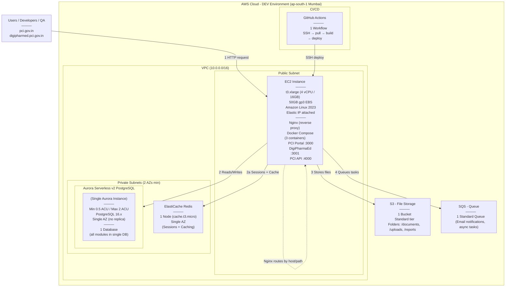

> ⚠️ **DISCLAIMER:** This is a DEV environment setup for development and testing purposes. Since the project is under active development, infrastructure requirements may change as the architecture evolves. This document should be treated as a living document and updated accordingly.

---

## Application Overview

| # | Application | Domain | Type | Description |
|---|-------------|--------|------|-------------|
| 1 | PCI Portal | pci.gov.in | Frontend (Next.js SSR) | Public-facing Pharmacy Council of India website — information, notifications, approved colleges, regulations |
| 2 | DigiPharmaEd | digipharmed.pci.gov.in | Frontend (React SPA) | Login-based portal — routes to 5 role-based dashboards after authentication |
| 3 | PCI API | /api/* | Backend (Node.js) | Single REST API serving both frontends with role-based access control |

---

## DigiPharmaEd — Portal Configurations

> All portals are part of the DigiPharmaEd platform. After login/registration, the user is routed to their respective dashboard based on their role.

| # | Portal | Who | Description |
|---|--------|-----|-------------|
| 1 | Pharmacist Registration | Licensed pharmacists | Register as a licensed pharmacist, access continuing education and professional development resources |
| 2 | Organisation Registration | Pharma Company / Retail Shop / Hospital / CRO | Job portal for pharma organisations |
| 3 | Examining Authority Registration | Examining authorities | Register to conduct examinations and manage assessment processes for pharmacy education |
| 4 | Student Registration | Pharmacy students | Access academic resources, track progress, manage educational journey |
| 5 | Institute Registration | Pharmacy institutes | Manage programs, faculty, infrastructure, and compliance with regulatory requirements |

---

## Nginx Routing Rules (on EC2)

| # | Rule Type | Condition | Proxies To | Details |
|---|-----------|-----------|------------|---------|
| 1 | Host-based | `pci.gov.in` / `www.pci.gov.in` | PCI Portal (:3000) | Public-facing website (Next.js SSR) |
| 2 | Host-based | `digipharmed.pci.gov.in` | DigiPharmaEd (:3001) | Login-based SPA with 5 role configs |
| 3 | Path-based | `/api/*` | PCI API (:4000) | Single backend API |
| 4 | Default | `*` (everything else) | PCI Portal (:3000) | Fallback to public website |

---

## Authentication & Routing Flow

| # | Step | What Happens |
|---|------|-------------|
| 1 | User visits digipharmed.pci.gov.in | Nginx routes to DigiPharmaEd SPA container |
| 2 | User logs in | SPA sends credentials to `/api/auth/login` |
| 3 | API authenticates | Validates credentials, returns JWT with role claim |
| 4 | SPA reads role from JWT | Routes user to the correct dashboard (Pharmacist / Organisation / Examining Authority / Student / Institute) |
| 5 | SPA calls role-specific APIs | All API calls include JWT — backend enforces role-based access control |
| 6 | API processes request | Validates JWT, checks role permissions, queries single database, returns response |

---

## EC2 Container Summary

| # | Container | Type | Internal Port | Routing |
|---|-----------|------|---------------|---------|
| 1 | PCI Portal | Frontend (Next.js SSR) | 3000 | Host: pci.gov.in (default) |
| 2 | DigiPharmaEd | Frontend (React SPA) | 3001 | Host: digipharmed.pci.gov.in |
| 3 | PCI API | Backend (Node.js) | 4000 | Path: /api/* |

> Key Points:
> - All 3 containers run on a single EC2 instance via Docker Compose
> - Nginx on EC2 acts as reverse proxy — routes by host header to the correct container
> - No ECS, no ECR, no ALB — simple single-server setup for DEV
> - Elastic IP gives a stable public IP, domains can be pointed via DNS or /etc/hosts for testing

---

## DEV Environment — Minimum Configuration (ap-south-1 Mumbai)

> Naming Convention: All resources should follow `pci-<resource>-dev` pattern (e.g. pci-ec2-dev, pci-db-dev)

| Service | Config | Details |
|---------|--------|---------|
| VPC | 10.0.0.0/16 | 1 public subnet + 2 private subnets (Aurora needs 2 AZs) |
| EC2 | t3.xlarge | 4 vCPU, 16GB RAM, 50GB gp3 EBS, Amazon Linux 2023, Elastic IP, Docker + Docker Compose + Nginx |
| Containers | 3 Docker containers | PCI Portal (:3000), DigiPharmaEd (:3001), API (:4000) |
| Aurora Serverless v2 | 0.5 – 2 ACU | PostgreSQL 16.x, single AZ, no replica, 1 database |
| ElastiCache Redis | cache.t3.micro | 1 node, single AZ (sessions + caching) |
| S3 | 1 bucket | Standard tier, no versioning |
| SQS | 1 standard queue | Default settings, 4-day retention |
| Security Groups | 3 minimum | EC2 (inbound 80, 443, 22), Aurora (5432 from EC2), Redis (6379 from EC2) |
| IAM | EC2 Instance Role | S3, SQS, CloudWatch Logs permissions |
| GitHub Actions | 1 workflow | SSH into EC2 → pull → build → deploy |

---

## What DevOps Team Needs to Prepare (DEV)

| # | Item | Config / Details |
|---|------|-----------------|
| 1 | VPC | 10.0.0.0/16, 1 public subnet + 2 private subnets (Aurora requirement) |
| 2 | EC2 Instance | t3.xlarge, 50GB gp3, Amazon Linux 2023, public subnet, Elastic IP |
| 3 | EC2 Software | Install Docker, Docker Compose, Nginx, Git |
| 4 | Security Groups | EC2 (inbound 80, 443, 22 from allowed IPs), Aurora (5432 from EC2 SG), Redis (6379 from EC2 SG) |
| 5 | Aurora Serverless v2 | PostgreSQL 16.x, 0.5–2 ACU, single AZ, no replica, 1 database, private subnets |
| 6 | ElastiCache Redis | cache.t3.micro, 1 node, single AZ, private subnet |
| 7 | S3 | 1 bucket (pci-files-dev), standard tier, no versioning |
| 8 | SQS | 1 standard queue, default settings |
| 9 | IAM — EC2 Instance Role | Permissions: S3, SQS, CloudWatch Logs |
| 10 | IAM — GitHub Deploy | SSH key pair for GitHub Actions to SSH into EC2 (or SSM Session Manager) |

---

## What DevOps Team Needs to Share Back With Us (DEV)

| # | Item | Example |
|---|------|---------|
| 1 | EC2 Public IP (Elastic IP) | 13.xxx.xxx.xxx |
| 2 | EC2 SSH Key | pci-ec2-dev.pem (or SSM access configured) |
| 3 | Aurora DB Endpoint | pci-db-dev.cluster-xxx.ap-south-1.rds.amazonaws.com |
| 4 | Aurora DB Name + Credentials | Database name + master username/password |
| 5 | Redis Endpoint | pci-redis-dev.xxx.ap-south-1.cache.amazonaws.com:6379 |
| 6 | S3 Bucket Name | pci-files-dev |
| 7 | SQS Queue URL | https://sqs.ap-south-1.amazonaws.com/ACCOUNT_ID/pci-queue-dev |

---

## Estimated Monthly Cost — DEV Environment (ap-south-1 Mumbai)

> Prices as of April 2026 (On-Demand). Actual costs may vary based on usage. Verify latest pricing on [AWS Pricing](https://aws.amazon.com/pricing/).

| # | Service | Config | Unit Price | Monthly Estimate (USD) |
|---|---------|--------|-----------|----------------------|
| 1 | EC2 (t3.xlarge) | 1 instance, 24/7 | $0.1792/hr | ~$131 |
| 2 | EBS (gp3) | 50GB | $0.08/GB/mo | ~$4 |
| 3 | Elastic IP | 1x (attached to running instance) | Free while attached | ~$0 |
| 4 | Aurora Serverless v2 | 0.5–2 ACU avg, 24/7 | ~$0.14/ACU-hr | ~$51–$204 |
| 5 | Aurora Storage | ~10GB | $0.10/GB/mo | ~$1 |
| 6 | ElastiCache Redis | cache.t3.micro, 24/7 | $0.017/hr | ~$12 |
| 7 | S3 | ~5GB | $0.025/GB/mo | ~$1 |
| 8 | SQS | ~100K requests/mo | $0.40/1M requests | ~$0 (free tier) |
| | | | **Total** | **~$200–$353/mo** |

> Notes:
> - No ALB cost — Nginx on EC2 handles routing
> - No NAT Gateway cost — EC2 is in public subnet with Elastic IP
> - No ECR cost — images built directly on EC2
> - Aurora cost range depends on ACU usage — lower end for light dev, higher for active testing
> - Data transfer out to internet is additional (~$0.09/GB)
> - No domain or SSL costs included (testing via Elastic IP, can add Let's Encrypt for free SSL)

---

## Production Requirements (Future — For Client Awareness)

> The following will be required when moving from DEV to Production. This is for planning purposes only.

| # | Item | Production Requirement |
|---|------|----------------------|
| 1 | Domain + SSL | Wildcard SSL cert for *.pci.gov.in (NIC-provided), Route 53 hosted zone, ACM for cert management |
| 2 | ALB | Move from Nginx-on-EC2 to ALB for high availability, health checks, and auto-scaling |
| 3 | ECS or Multi-EC2 | Move to ECS Fargate or multiple EC2 instances behind ALB for HA and scaling |
| 4 | CloudFront | CDN in front of ALB — caches static assets, reduces SSR load, improves latency across India |
| 5 | WAF | Mandatory for Indian govt — OWASP protection, rate limiting, IP filtering, bot protection |
| 6 | Aurora | Higher ACU (min 2, max 16+), Multi-AZ with read replicas, automated backups, point-in-time recovery |
| 7 | NAT Gateway | For private subnet EC2/ECS instances (1 per AZ) |
| 8 | CloudTrail | Audit logging — mandatory for govt compliance |
| 9 | CloudWatch | Full monitoring, alarms, dashboards, log retention policies |
| 10 | Secrets Manager | For DB credentials, JWT secrets, API keys — no hardcoded secrets |
| 11 | Backup | Automated Aurora snapshots, S3 cross-region replication (optional) |
| 12 | Security | MeitY/NIC compliance, data residency in India (ap-south-1), security audit trail |
| 13 | Multi-AZ | All critical services (Aurora, EC2/ECS, NAT) across minimum 2 AZs |
| 14 | Redis | Upgrade to Multi-AZ replication group for session HA |

---

> ⚠️ **Note:** This infrastructure is for the development phase. The project has a simple architecture — 2 frontends + 1 backend API running as 3 Docker containers on a single EC2 instance with Nginx as reverse proxy. DigiPharmaEd serves 5 registration portals within the same platform. No ECS, no ALB, no microservices complexity. For production, this should be migrated to a proper HA setup (ALB + ECS/multi-EC2). Infrastructure requirements should be reviewed as the project evolves.
