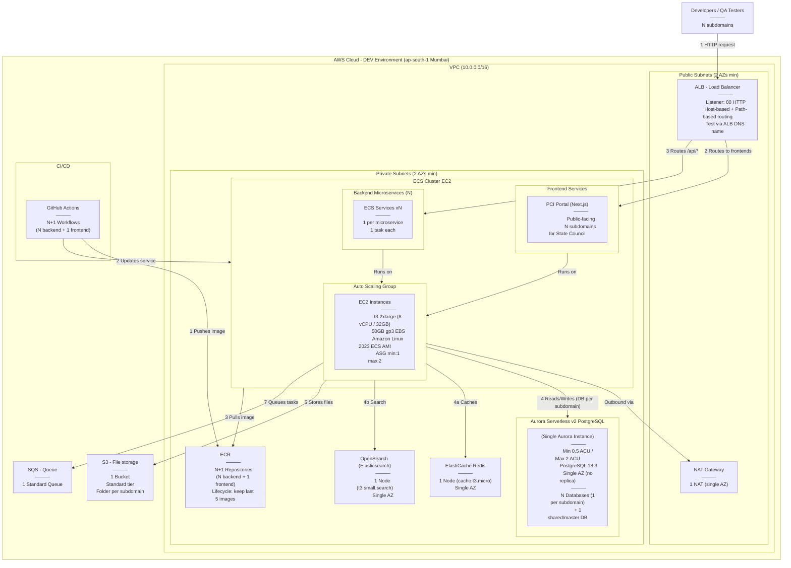

> ⚠️ **DISCLAIMER:** This is a DEV environment setup for development and testing purposes. Since the project is under active development, infrastructure requirements may change as the architecture evolves. This document should be treated as a living document and updated accordingly.

---

## ALB Routing Rules

| # | Rule Type | Condition | Routes To | Details |
|---|-----------|-----------|-----------|---------|
| 1 | Path-based | `/api/service-1/*` | Backend TG 1 | Backend microservice 1 |
| 2 | Path-based | `/api/service-2/*` | Backend TG 2 | Backend microservice 2 |
| 3 | Path-based | `/api/service-N/*` | Backend TG N | Backend microservice N |
| 4 | Default | `*` (everything else) | PCI Portal TG | Public-facing frontend (Next.js), handles N subdomains |

---

## Subdomain → Database Mapping

| # | What | How |
|---|------|-----|
| 1 | User visits a subdomain | ALB routes to the correct frontend based on host header |
| 2 | Frontend detects subdomain | Reads `Host` header, loads subdomain-specific config (branding, features) |
| 3 | Frontend calls backend APIs | Passes subdomain context in request header |
| 4 | Backend resolves DB | Maps subdomain to database name (e.g. `sub1` → `pci_sub1_dev`) |
| 5 | Backend queries correct DB | Connects to the right database within the same Aurora instance |
| 6 | Response returned | Frontend renders SSR page with subdomain-specific data |

---

## ECS Services Summary

| # | Service | Type | Tasks | Routing |
|---|---------|------|-------|---------|
| 1 | PCI Portal | Frontend (Next.js) | 1 | Host: all subdomains (default) |
| 2–N+1 | Microservices | Backend | 1 each | Path: `/api/{service}/*` |

> Key Points:
> - All subdomains share the same PCI Portal frontend — subdomain is detected at runtime
> - All backend microservices are shared — DB context switches per request based on subdomain
> - 1 Aurora instance holds N databases — no separate DB instances per subdomain
> - Subdomain-to-DB mapping is stored in a shared/master database or config
> - For DEV: ALB DNS name is used directly, subdomain can be passed via header for testing

---

## DEV Environment — Minimum Configuration (ap-south-1 Mumbai)

> Naming Convention: All resources should follow `pci-<resource>-dev` pattern (e.g. pci-cluster-dev, pci-alb-dev, pci-db-dev)

| Service | Config | Details |
|---------|--------|---------|
| VPC | 10.0.0.0/16 | 2 public subnets + 2 private subnets across 2 AZs |
| NAT Gateway | 1x single AZ | Single AZ |
| ALB | 1x Application LB | HTTP 80, host-based routing (subdomains) + path-based routing (APIs) |
| EC2 (ECS) | t3.2xlarge | 8 vCPU, 32GB RAM, 50GB gp3 EBS, Amazon Linux 2023 ECS AMI, ASG min:1 max:2 |
| ECS — Frontend | 1 service | PCI Portal (Next.js SSR), 1 task, subdomain-based multi-tenancy |
| ECS — Backend | N services | 1 per microservice, 1 task each |
| Aurora Serverless v2 | 0.5 – 2 ACU | PostgreSQL 18.3, single AZ, no replica, N databases (1 per subdomain) + 1 shared DB |
| ElastiCache Redis | cache.t3.micro | 1 node, single AZ |
| OpenSearch | t3.small.search | 1 node, single AZ, 10GB EBS |
| ECR | N+1 repositories | N backend + 1 frontend, lifecycle: keep last 5 images |
| S3 | 1 bucket | Standard tier, no versioning, folder per subdomain |
| SQS | 1 standard queue | Default settings, 4-day retention |
| Security Groups | 5 minimum | ALB (inbound 80), EC2 (inbound from ALB only), Aurora (inbound 5432 from EC2), Redis (inbound 6379 from EC2), OpenSearch (inbound 443 from EC2) |
| IAM | ECS Task Role + Execution Role | S3, SQS, ECR, CloudWatch Logs permissions |
| GitHub Actions | N+1 workflows | N backend + 1 frontend (build → push to ECR → update ECS service) |

---

## What DevOps Team Needs to Prepare (DEV)

| # | Item | Config / Details |
|---|------|-----------------|
| 1 | VPC | 10.0.0.0/16, 2 public + 2 private subnets across 2 AZs |
| 2 | NAT Gateway | 1x single AZ |
| 3 | ALB | HTTP 80 listener, host-based routing (subdomains) + path-based routing (APIs), N+1 target groups |
| 4 | Security Groups | ALB (inbound 80), EC2 (inbound from ALB only), Aurora (5432 from EC2), Redis (6379 from EC2), OpenSearch (443 from EC2) |
| 5 | ECS Cluster (EC2) | t3.2xlarge, 50GB gp3, Amazon Linux 2023 ECS AMI, ASG min:1 max:2 |
| 6 | ECS — Frontend | 1 service (PCI Portal), 1 task |
| 7 | ECS — Backend | N services, N task definitions |
| 8 | Aurora Serverless v2 | PostgreSQL 18.3, 0.5–2 ACU, single AZ, no replica, N databases created inside |
| 9 | ElastiCache Redis | cache.t3.micro, 1 node, single AZ |
| 10 | OpenSearch | t3.small.search, 1 node, single AZ, 10GB EBS |
| 11 | ECR | N+1 repositories (N backend + 1 frontend), lifecycle: keep last 5 images |
| 12 | S3 | 1 bucket, standard tier, no versioning |
| 13 | SQS | 1 standard queue, default settings |
| 14 | IAM — GitHub OIDC | OIDC provider for GitHub Actions, trusted to our repo only |
| 15 | IAM — Deploy Role | Permissions: ECR push, ECS update service, register task def, pass role |
| 16 | IAM — ECS Task Role | Permissions: S3, SQS, Redis, OpenSearch access for the running app |
| 17 | IAM — ECS Execution Role | Permissions: ECR pull, CloudWatch Logs |

---

## What DevOps Team Needs to Share Back With Us (DEV)

| # | Item | Example |
|---|------|---------|
| 1 | ECR Repository URLs | 123456789.dkr.ecr.ap-south-1.amazonaws.com/pci-{service-name}-dev (xN+1) |
| 2 | ECS Cluster Name | pci-cluster-dev |
| 3 | ECS Service Names | pci-{service-name}-dev (xN+1) |
| 4 | IAM Deploy Role ARN | arn:aws:iam::ACCOUNT_ID:role/pci-github-deploy-dev |
| 5 | Aurora DB Endpoint | pci-db-dev.cluster-xxx.ap-south-1.rds.amazonaws.com |
| 6 | Aurora DB Names + Credentials | N database names + master username/password |
| 7 | Redis Endpoint | pci-redis-dev.xxx.ap-south-1.cache.amazonaws.com:6379 |
| 8 | OpenSearch Endpoint | pci-search-dev.ap-south-1.es.amazonaws.com |
| 9 | S3 Bucket Name | pci-files-dev |
| 10 | SQS Queue URL | https://sqs.ap-south-1.amazonaws.com/ACCOUNT_ID/pci-queue-dev |
| 11 | ALB DNS Name | pci-alb-dev-123.ap-south-1.elb.amazonaws.com |

---

## Estimated Monthly Cost — DEV Environment (ap-south-1 Mumbai)

> Prices as of April 2026 (On-Demand). Actual costs may vary based on usage. Verify latest pricing on [AWS Pricing](https://aws.amazon.com/pricing/).

| # | Service | Config | Unit Price | Monthly Estimate (USD) |
|---|---------|--------|-----------|----------------------|
| 1 | EC2 (t3.2xlarge) | 1 instance, 24/7 | $0.3584/hr | ~$262 |
| 2 | EBS (gp3) | 50GB | $0.08/GB/mo | ~$4 |
| 3 | NAT Gateway | 1x, 24/7 + ~50GB data | $0.056/hr + $0.056/GB | ~$44 |
| 4 | ALB | 1x, 24/7 + LCU | $0.0225/hr + LCU | ~$18 |
| 5 | Aurora Serverless v2 | 0.5–2 ACU avg, 24/7 (N DBs) | ~$0.14/ACU-hr | ~$51–$204 |
| 6 | Aurora Storage | ~20GB (across N DBs) | $0.10/GB/mo | ~$2 |
| 7 | ECR | N+1 repos, ~5GB total | $0.10/GB/mo | ~$1 |
| 8 | ElastiCache Redis | cache.t3.micro, 24/7 | $0.017/hr | ~$12 |
| 9 | OpenSearch | t3.small.search, 24/7 + 10GB | $0.036/hr + $0.135/GB | ~$28 |
| 10 | S3 | ~10GB | $0.025/GB/mo | ~$1 |
| 11 | SQS | ~100K requests/mo | $0.40/1M requests | ~$0 (free tier) |
| | | | **Total (1 instance)** | **~$423–$576/mo** |
| | | | **Total (2 instances)** | **~$689–$842/mo** |

> Notes:
> - Aurora cost range depends on ACU usage — N databases on 1 instance may push ACU higher during active development
> - ASG max:2 means EC2 + EBS cost doubles when 2nd instance spins up (~$266 extra)
> - Data transfer out to internet is additional (~$0.09/GB)
> - S3 cost scales with storage usage and request volume (PUT/GET requests charged separately)
> - No domain or SSL costs included (testing via ALB DNS)

---

## Production Requirements (Future — For Client Awareness)

> The following will be required when moving from DEV to Production. This is for planning purposes only.

| # | Item | Production Requirement |
|---|------|----------------------|
| 1 | Domain + SSL | Wildcard SSL cert (client-provided), Route 53 hosted zone, ACM for cert management |
| 2 | CloudFront | CDN in front of ALB — caches static assets, reduces SSR load, improves latency across India |
| 3 | WAF | Mandatory for Indian govt — OWASP protection, rate limiting, IP filtering |
| 4 | Aurora | Higher ACU (min 2, max 16+), Multi-AZ with read replicas, automated backups |
| 5 | EC2 / ECS | Multiple instances across AZs, ASG with auto-scaling policies for both frontend and backend |
| 6 | NAT Gateway | 1 per AZ for high availability (min 2) |
| 7 | CloudTrail | Audit logging — mandatory for govt compliance |
| 8 | CloudWatch | Full monitoring, alarms, dashboards, log retention policies |
| 9 | Secrets Manager | For DB credentials, API keys — no hardcoded secrets |
| 10 | Backup | Automated Aurora snapshots, S3 cross-region replication (optional) |
| 11 | Security | MeitY/NIC compliance, data residency in India (ap-south-1), security audit trail |
| 12 | Multi-AZ | All critical services (Aurora, NAT, EC2) across minimum 2 AZs |
| 13 | Frontend Auto-Scaling | PCI Portal (Next.js) needs auto-scaling under heavy traffic |

---

> ⚠️ **Note:** This infrastructure is for the development phase. As the project is under active development, the number of microservices, subdomains, database schemas, and resource sizing may change. Infrastructure requirements should be reviewed and adjusted periodically as the architecture evolves. Any changes will be communicated to the DevOps team in advance.
