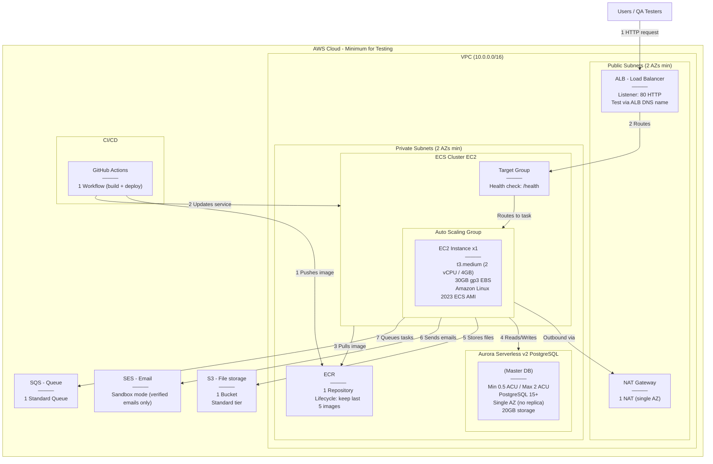

---

## Minimum Testing Configuration

| Service | Config | Details |
|---------|--------|---------|
| VPC | 10.0.0.0/16 | 2 public subnets + 2 private subnets across 2 AZs |
| NAT Gateway | 1x single AZ | Saves cost vs HA (1 per AZ) |
| ALB | 1x Application LB | HTTP 80 listener, test via ALB DNS name directly |
| EC2 (ECS) | t3.medium | 2 vCPU, 4GB RAM, 30GB gp3 EBS, Amazon Linux 2023 ECS-optimized AMI |
| ECS Task | 1 task | CPU: 1024 (1 vCPU), Memory: 2048 MB |
| Aurora Serverless v2 | 0.5 – 2 ACU | PostgreSQL 15+, single AZ, no read replica, ~20GB storage |
| ECR | 1 repository | Lifecycle policy: retain last 5 images |
| S3 | 1 bucket | Standard storage class, no versioning |
| SES | Sandbox mode | Only verified sender/receiver emails, no production approval needed |
| SQS | 1 standard queue | Default settings, 4-day retention |
| Security Groups | 3 minimum | ALB (inbound 80), EC2 (inbound from ALB only), Aurora (inbound 5432 from EC2 only) |
| IAM | ECS Task Role + Execution Role | S3, SES, SQS, ECR, CloudWatch Logs permissions |
| GitHub Actions | 1 workflow | Build image → push to ECR → update ECS service |

---

## What DevOps Team Needs to Prepare

| # | Item | Config / Details |
|---|------|-----------------|
| 1 | VPC | 10.0.0.0/16, 2 public + 2 private subnets across 2 AZs |
| 2 | NAT Gateway | 1x single AZ |
| 3 | ALB | HTTP 80 listener, target group with health check on /health |
| 4 | Security Groups | ALB (inbound 80), EC2 (inbound from ALB only), Aurora (inbound 5432 from EC2 only) |
| 5 | ECS Cluster (EC2) | 1x t3.medium, 30GB gp3, Amazon Linux 2023 ECS AMI |
| 6 | ECS Task Definition | CPU: 1024, Memory: 2048 MB, container port as per app |
| 7 | ECS Service | 1 desired task, linked to ALB target group |
| 8 | Aurora Serverless v2 | PostgreSQL 15+, 0.5–2 ACU, single AZ, no replica |
| 9 | ECR | 1 repository, lifecycle: keep last 5 images |
| 10 | S3 | 1 bucket, standard tier, no versioning |
| 11 | SES | Sandbox mode, verify sender/receiver emails |
| 12 | SQS | 1 standard queue, default settings |
| 13 | IAM — GitHub OIDC | OIDC provider for GitHub Actions, trusted to our repo only |
| 14 | IAM — Deploy Role | Permissions: ECR push, ECS update service, register task def, pass role |
| 15 | IAM — ECS Task Role | Permissions: S3, SES, SQS access for the running app |
| 16 | IAM — ECS Execution Role | Permissions: ECR pull, CloudWatch Logs |

---

## What DevOps Team Needs to Share Back With Us

| # | Item | Example |
|---|------|---------|
| 1 | ECR Repository URL | 123456789.dkr.ecr.region.amazonaws.com/app-name |
| 2 | ECS Cluster Name | my-cluster |
| 3 | ECS Service Name | my-service |
| 4 | IAM Deploy Role ARN | arn:aws:iam::ACCOUNT_ID:role/github-deploy-role |
| 5 | Aurora DB Endpoint | my-cluster.cluster-xxx.region.rds.amazonaws.com |
| 6 | Aurora DB Name + Credentials | Database name, username, password |
| 7 | S3 Bucket Name | my-app-files-bucket |
| 8 | SQS Queue URL | https://sqs.region.amazonaws.com/ACCOUNT_ID/my-queue |
| 9 | SES Verified Sender Email | [email] |
| 10 | ALB DNS Name | my-alb-123.region.elb.amazonaws.com (for testing) |
