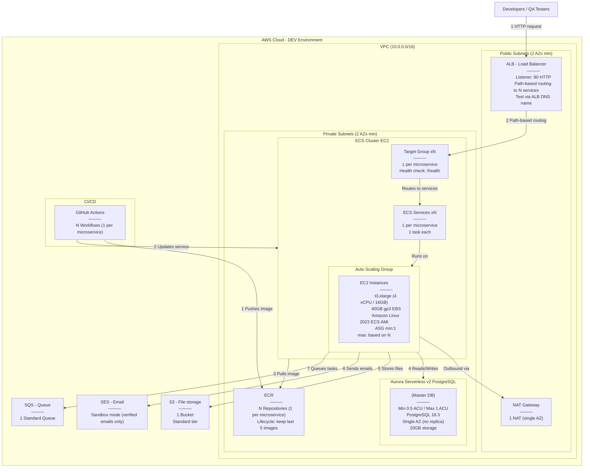

---

## DEV Environment — Minimum Configuration

> Naming Convention: All resources should follow `pci-<resource>-dev` pattern (e.g. pci-cluster-dev, pci-alb-dev, pci-db-dev)

| Service | Config | Details |
|---------|--------|---------|
| VPC | 10.0.0.0/16 | 2 public subnets + 2 private subnets across 2 AZs |
| NAT Gateway | 1x single AZ | Single AZ |
| ALB | 1x Application LB | HTTP 80 listener, path-based routing to N services, test via ALB DNS name |
| EC2 (ECS) | t3.xlarge | 4 vCPU, 16GB RAM, 40GB gp3 EBS, Amazon Linux 2023 ECS-optimized AMI, ASG min:1 max:3 |
| ECS Services | N services | 1 per microservice, 1 task each |
| ECS Task | N task definitions | CPU: 256 (0.25 vCPU), Memory: 512 MB per service |
| Aurora Serverless v2 | 0.5 – 1 ACU | PostgreSQL 18.3, single AZ, no read replica, ~20GB storage |
| ECR | N repositories | 1 per microservice, lifecycle: keep last 5 images |
| S3 | 1 bucket | Standard storage class, no versioning |
| SES | Sandbox mode | Only verified sender/receiver emails, no production approval needed |
| SQS | 1 standard queue | Default settings, 4-day retention |
| Security Groups | 3 minimum | ALB (inbound 80), EC2 (inbound from ALB only), Aurora (inbound 5432 from EC2 only) |
| IAM | ECS Task Role + Execution Role | S3, SES, SQS, ECR, CloudWatch Logs permissions |
| GitHub Actions | N workflows | 1 per microservice (build → push to ECR → update ECS service) |

---

## What DevOps Team Needs to Prepare (DEV)

| # | Item | Config / Details |
|---|------|-----------------|
| 1 | VPC | 10.0.0.0/16, 2 public + 2 private subnets across 2 AZs |
| 2 | NAT Gateway | 1x single AZ |
| 3 | ALB | HTTP 80 listener, path-based routing, N target groups with health check on /health |
| 4 | Security Groups | ALB (inbound 80), EC2 (inbound from ALB only), Aurora (inbound 5432 from EC2 only) |
| 5 | ECS Cluster (EC2) | 1x t3.xlarge, 40GB gp3, Amazon Linux 2023 ECS AMI, ASG min:1 max: based on N |
| 6 | ECS Task Definitions | N task definitions, CPU: 256, Memory: 512 MB each, container port as per app |
| 7 | ECS Services | N services (1 per microservice), 1 desired task each, linked to target groups |
| 8 | Aurora Serverless v2 | PostgreSQL 18.3, 0.5–1 ACU, single AZ, no replica |
| 9 | ECR | N repositories (1 per microservice), lifecycle: keep last 5 images |
| 10 | S3 | 1 bucket, standard tier, no versioning |
| 11 | SES | Sandbox mode, verify sender/receiver emails |
| 12 | SQS | 1 standard queue, default settings |
| 13 | IAM — GitHub OIDC | OIDC provider for GitHub Actions, trusted to our repo only |
| 14 | IAM — Deploy Role | Permissions: ECR push, ECS update service, register task def, pass role |
| 15 | IAM — ECS Task Role | Permissions: S3, SES, SQS access for the running app |
| 16 | IAM — ECS Execution Role | Permissions: ECR pull, CloudWatch Logs |

---

## What DevOps Team Needs to Share Back With Us (DEV)

| # | Item | Example |
|---|------|---------|
| 1 | ECR Repository URLs | 123456789.dkr.ecr.region.amazonaws.com/pci-{service-name}-dev (xN) |
| 2 | ECS Cluster Name | pci-cluster-dev |
| 3 | ECS Service Names | pci-{service-name}-dev (xN) |
| 4 | IAM Deploy Role ARN | arn:aws:iam::ACCOUNT_ID:role/pci-github-deploy-dev |
| 5 | Aurora DB Endpoint | pci-db-dev.cluster-xxx.region.rds.amazonaws.com |
| 6 | Aurora DB Name + Credentials | Database name, username, password |
| 7 | S3 Bucket Name | pci-files-dev |
| 8 | SQS Queue URL | https://sqs.region.amazonaws.com/ACCOUNT_ID/pci-queue-dev |
| 9 | SES Verified Sender Email | [email] |
| 10 | ALB DNS Name | pci-alb-dev-123.region.elb.amazonaws.com |
