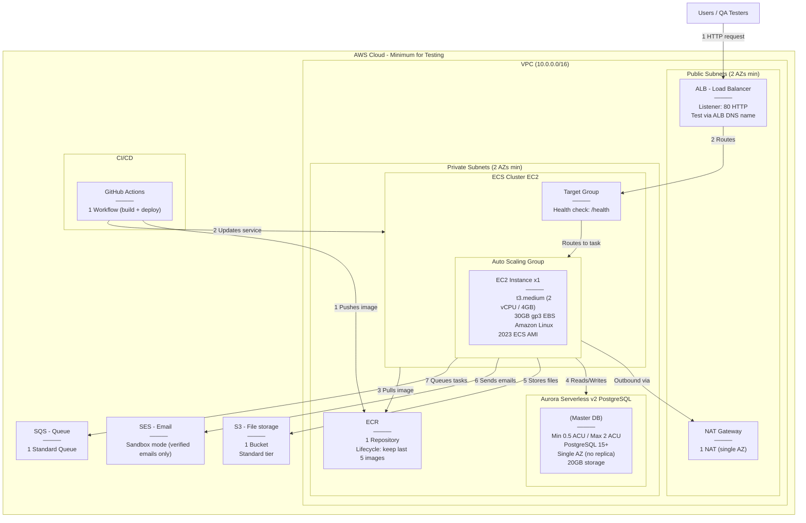

---

## Minimum Testing Configuration

| Service | Config | Details |
|---------|--------|---------|
| VPC | 10.0.0.0/16 | 2 public subnets + 2 private subnets across 2 AZs |
| NAT Gateway | 1x single AZ | Saves cost vs HA (1 per AZ) |
| ALB | 1x Application LB | HTTP 80 listener, test via ALB DNS name directly |
| EC2 (ECS) | t3.medium | 2 vCPU, 4GB RAM, 30GB gp3 EBS, Amazon Linux 2023 ECS-optimized AMI |
| ECS Task | 1 task | CPU: 1024 (1 vCPU), Memory: 2048 MB |
| Aurora Serverless v2 | 0.5 – 2 ACU | PostgreSQL 15+, single AZ, no read replica, ~20GB storage |
| ECR | 1 repository | Lifecycle policy: retain last 5 images |
| S3 | 1 bucket | Standard storage class, no versioning |
| SES | Sandbox mode | Only verified sender/receiver emails, no production approval needed |
| SQS | 1 standard queue | Default settings, 4-day retention |
| Security Groups | 3 minimum | ALB (inbound 80), EC2 (inbound from ALB only), Aurora (inbound 5432 from EC2 only) |
| IAM | ECS Task Role + Execution Role | S3, SES, SQS, ECR, CloudWatch Logs permissions |
| GitHub Actions | 1 workflow | Build image → push to ECR → update ECS service |
