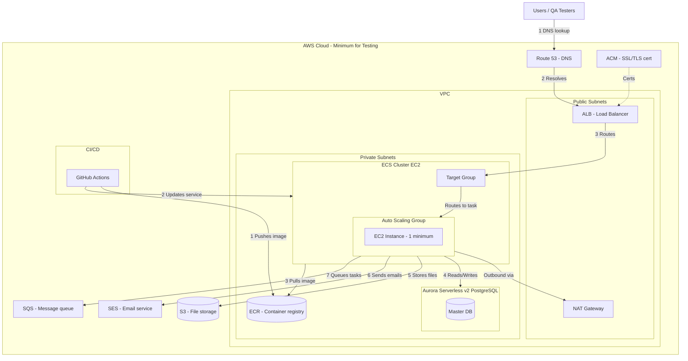

```mermaid
flowchart TB

User[Users / QA Testers]

subgraph AWS_Cloud[AWS Cloud - Minimum for Testing]

    Route53[Route 53 - DNS]
    ACM[ACM - SSL/TLS cert]

    subgraph VPC[VPC]

        subgraph Public_Subnets[Public Subnets]
            ALB[ALB - Load Balancer]
            NAT[NAT Gateway]
        end

        subgraph Private_Subnets[Private Subnets]

            subgraph ECS_Cluster[ECS Cluster EC2]
                TG[Target Group]
                subgraph ASG[Auto Scaling Group]
                    EC2_1[EC2 Instance - 1 minimum]
                end
            end

            subgraph Aurora_Cluster[Aurora Serverless v2 PostgreSQL]
                MasterDB[(Master DB)]
            end

            ECR[(ECR - Container registry)]

        end

    end

    S3[(S3 - File storage)]
    SES[SES - Email service]
    SQS[SQS - Message queue]

    subgraph CICD[CI/CD]
        GitHub[GitHub Actions]
    end

end

%% Request Flow
User -- "1 DNS lookup" --> Route53
Route53 -- "2 Resolves" --> ALB
ACM -. Certs .-> ALB
ALB -- "3 Routes" --> TG
TG -- "Routes to task" --> ASG
ASG -- Outbound via --> NAT

%% App to Data Flow
ASG -- "4 Reads/Writes" --> Aurora_Cluster
ASG -- "5 Stores files" --> S3
ASG -- "6 Sends emails" --> SES
ASG -- "7 Queues tasks" --> SQS

%% CI/CD Flow
GitHub -- "1 Pushes image" --> ECR
GitHub -- "2 Updates service" --> ECS_Cluster
ECS_Cluster -- "3 Pulls image" --> ECR

```
