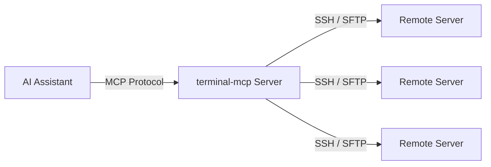
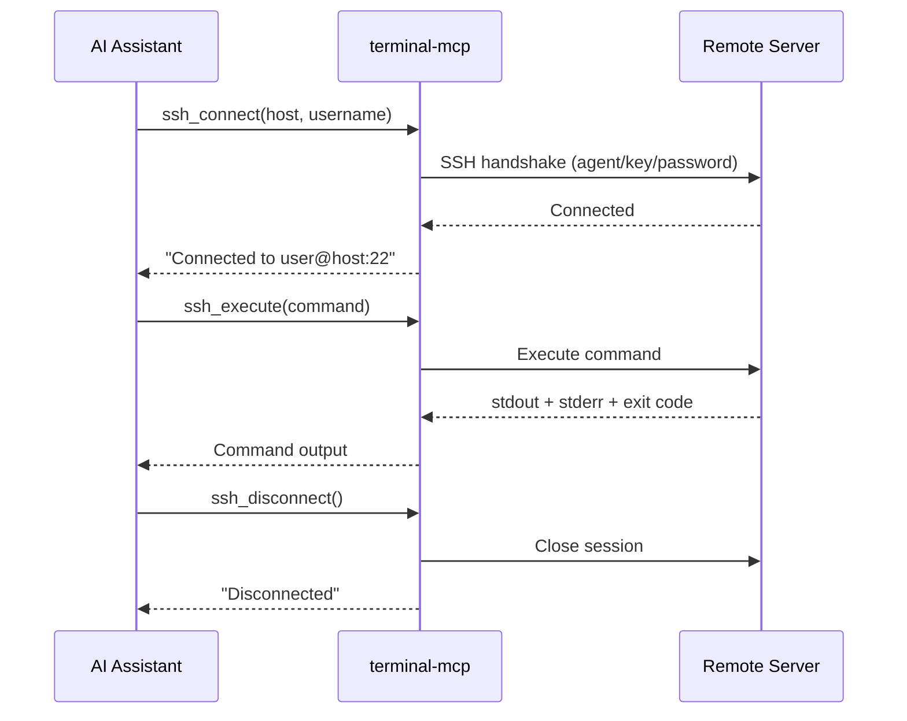

# terminal-mcp

An MCP server that gives AI assistants (like Kiro) remote terminal access via SSH.



## Tools

| Tool | What it does |
|------|-------------|
| `ssh_connect` | Connect to a server (password, key, or ssh-agent) |
| `ssh_execute` | Run a command on the remote server |
| `ssh_upload` | Upload a file via SFTP |
| `ssh_download` | Download a file via SFTP |
| `ssh_disconnect` | Close a connection |
| `ssh_list_connections` | List active connections |

## Prerequisites

- Node.js (v18+)
- SSH access to your target server(s)
- If your SSH key has a passphrase, you must have `ssh-agent` running with your key loaded:

```bash
eval "$(ssh-agent -s)"
ssh-add ~/.ssh/id_rsa
```

Verify with `ssh-add -l` — you should see your key listed.

## Setup

### 1. Clone, install, and build

```bash
git clone <repo-url>
cd terminal-mcp
npm install
npm run build
```

### 2. Get the absolute path to the built server

```bash
pwd
# e.g. /Users/yourname/terminal-mcp
```

You'll need this for the MCP config — the full path is `<that output>/dist/index.js`.

### 3. Get your SSH_AUTH_SOCK value

This is required so the MCP server process can reach your ssh-agent for key-based auth.

```bash
echo $SSH_AUTH_SOCK
# e.g. /var/run/com.apple.launchd.xkoOBxuQXV/Listeners
```

> If you skip this, the server won't be able to authenticate with passphrase-protected keys. Password-only auth does not need this.

### 4. Add to your MCP config

The MCP config file is located at:

- User-level (global): `~/.kiro/settings/mcp.json`
- Workspace-level: `<your-project>/.kiro/settings/mcp.json`

User-level applies across all workspaces. Workspace-level is scoped to that project only.

If the file already exists, merge the `"terminal"` entry into your existing `"mcpServers"` block.

```json
{
  "mcpServers": {
    "terminal": {
      "command": "node",
      "args": ["/absolute/path/to/terminal-mcp/dist/index.js"],
      "env": {
        "SSH_AUTH_SOCK": "<your SSH_AUTH_SOCK value from step 3>"
      },
      "disabled": false,
      "autoApprove": []
    }
  }
}
```

### 5. Verify

The server auto-connects on config change. Check the MCP Servers panel in Kiro — `terminal` should show as running.

## Usage

Once configured, just ask your AI assistant to interact with remote servers:

- "Connect to myserver.example.com as ubuntu"
- "Run `df -h` on the server"
- "Upload local.txt to /tmp/remote.txt"
- "Disconnect from the server"

The assistant will call the appropriate MCP tools (`ssh_connect` → `ssh_execute` → `ssh_disconnect`).

## How it works


